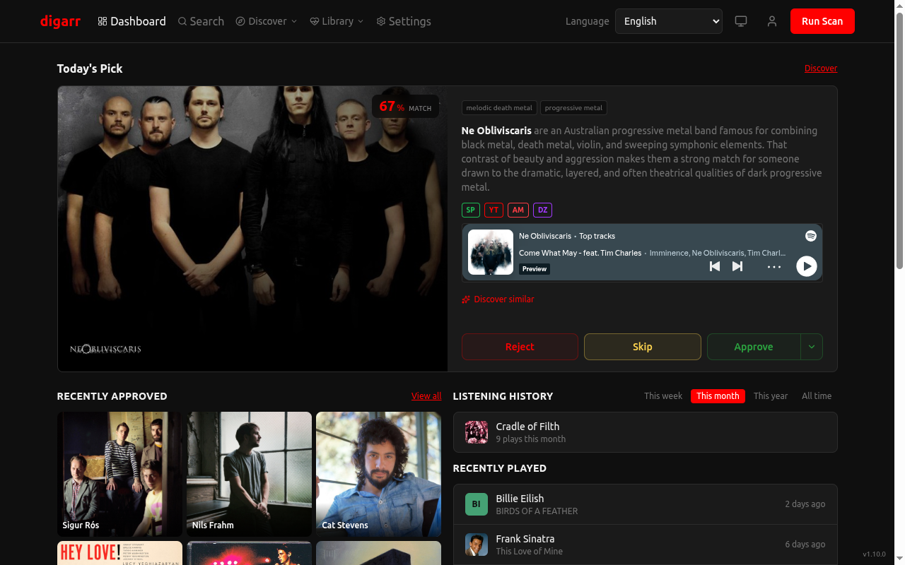

<p align="center">
  
</p>

<h1 align="center">digarr</h1>

[](https://github.com/iuliandita/digarr/actions/workflows/ci.yml)
[](LICENSE)
[](https://bun.sh)
[](https://www.typescriptlang.org)
[](deploy/docker/)
[](https://github.com/iuliandita/digarr/actions/workflows/ci.yml)
[](https://github.com/iuliandita/digarr/releases)

**Music discovery for your *arr stack.** Digarr builds a taste profile from your listening sources, asks your AI provider for candidates, scores them, and gives you a review queue. From there you can approve artists into Lidarr or playlist targets, run mood searches, save discovery subscriptions, generate playlists, and browse by genre. The UI and AI-assisted reasoning ship in 15 languages. It is self-hosted, so the data stays with you.

> [!NOTE]
> **v1.12.0 is out.** Digarr now runs with zero external database (embedded PGlite backend, plus an in-app migration tool between PGlite and PostgreSQL), speaks Subsonic (Navidrome, Airsonic, Gonic) as a first-class listening and library source, and surfaces AI provider failures in scan progress, job history, and connection tests instead of degrading silently. Recent releases also hardened OIDC account linking, made partial multi-target approvals retryable, and queued concurrent scans instead of rejecting them. See the [latest release notes](https://github.com/iuliandita/digarr/releases/latest) and [CHANGELOG.md](CHANGELOG.md) for details. If you run into something, [open an issue](https://github.com/iuliandita/digarr/issues).
>
> Documentation on `develop` also covers features available in the `:nightly` image but not yet in the latest tagged release. The changelog is the source of truth for released-version availability.
>
> Free and open source, forever. No tracking from Digarr itself. If you choose a hosted AI provider (Anthropic, OpenAI, Gemini) or point a local-provider option at a remote host, your discovery prompts are sent to that provider under its terms. Use Ollama on localhost or a local OpenAI-compatible endpoint to keep everything on your server.



[More screenshots](docs/SCREENSHOTS.md)

> [!IMPORTANT]
> **Why people pick Digarr**
>
> - 💿 **Album-level discovery** -- recommends and approves *individual albums* (gap-fills, new releases, net-new finds), not just artists. No whole-discography grabs.
> - 🧠 **AI you control** -- Anthropic, OpenAI, Gemini, Ollama, or any OpenAI-compatible endpoint, scored with **configurable weights** that learn from your approvals and rejections.
> - 💬 **Mood discovery** -- *"something like Boards of Canada but darker"* is a valid query.
> - 🧭 **14 discovery modes** -- ListenBrainz radios, Release Radar, Library Gap-Fill, artist relationship graphs, labels, charts, Deezer Flow, Spotify Saved Albums, Subsonic Starred -- all runnable on demand or saved as subscriptions.
> - 🔓 **No Lidarr required** -- full discovery-only mode; genre-aware scoring currently derives listening genres from Spotify when no library is connected.
> - 👥 **Real multi-user** -- OIDC/SSO plus per-user queues, credentials, scoring weights, and targets.
> - 🌍 **15 languages** -- the UI *and* the AI's reasoning, localized.
> - 🛡️ **Ops-grade self-hosting** -- zero-external-database single container, backup/restore, job observability, pre-flight upgrade checks, cosign-signed images.

> [!NOTE]
> **Built with AI.** A human sets the roadmap, designs the architecture, and reviews the output; most code and tests are AI-generated.

## What Makes Digarr Different

### Album-Level Discovery
Digarr ships album-level discovery as a first-class feature. The recommendation queue surfaces individual albums alongside artists -- gap-fills for artists you already follow, new releases you may have missed, and net-new album finds. Approving an album adds the artist to Lidarr **unmonitored** (no whole-discography grab) and monitors and searches only the approved album. The Discover page adds a kind filter (All / Artists / Albums) and a dedicated Albums navigation entry. Full i18n across all 15 shipped locales. Three producers feed the Albums tab: Release Radar (new releases from tracked artists), Library Gap-Fill (studio albums you are missing from tracked artists), and net-new album discovery (a specific album the AI suggests by a new-to-you artist, gated behind a default-off toggle in Settings > Recommendations > Advanced).

### 7-Stage AI Pipeline
Digarr takes signals from up to 9 sources, runs them through an AI-assisted pipeline, scores candidates with configurable weights, removes duplicates across batches, and learns from what you approve or reject.

### Mood Discovery
Type "something like Boards of Canada but darker" or "upbeat 90s pop for a road trip" and Digarr turns that into a result set. You do not have to translate the idea into filters first.

### Discovery Modes
Run focused discovery flows from Discover -> Discovery Modes (`/discover/modes`) for the shipped modes: ListenBrainz (Artist Radio, User Radio, Tag Radio, Similar Users Quick and Deep), Release Radar, Library Gap-Fill (studio albums you are missing from artists you already track), Similar Artist Web, Artist Relationships (MusicBrainz collaboration/membership/alias graph), Labels (co-label artists via Discogs; needs a connected Discogs account), Charts (artists trending on global or regional charts via Last.fm; needs a connected Last.fm account), Deezer Flow (artists from your personalized Deezer Flow feed; needs a connected Deezer account), Spotify Saved Albums (artists from the albums you saved on Spotify; needs a connected Spotify account), and Subsonic Starred (artists similar to the ones you starred on your Subsonic server; needs a connected Subsonic account). Manual runs now preflight invalid Artist Radio seeds before the job is accepted, and each accepted run is recorded in Jobs immediately so fast background failures are visible. Available discovery modes can be saved as subscriptions, and those subscriptions now reuse the same provider/fallback path as the manual run you configured.

### Auto-Playlists
Build playlists from approved recommendations and send them to Navidrome, Jellyfin, Emby, Plex, or Spotify, or export them as M3U/XSPF. The built-in playlist types are Weekly Digest, Genre Focus, Mood Mix, and Rediscover.

### Your AI, Your Choice
Use Anthropic, OpenAI, Google Gemini, Ollama, or any OpenAI-compatible endpoint. Recommendation cards include a short explanation of why an artist made the cut.

### Multilingual UI and AI Output
Digarr now ships localized catalogs for 15 languages, a visible language switcher before and after login, persisted per-user locale preferences, and locale-aware AI reasoning for mood discovery, quick discover, and full scans.

> [!NOTE]
> Shipped UI languages: English, Spanish, French, German, Portuguese (Brazil), Italian, Dutch, Romanian, Polish, Turkish, Ukrainian, Russian, Japanese, Korean, and Simplified Chinese.
>
> Translations are reviewed in-repo and checked for missing or untranslated catalog values. If you notice awkward wording or missing context, please [open an issue](https://github.com/iuliandita/digarr/issues) or send a PR with fixes.

### Flexible Setup
The setup wizard supports three starting points: Lidarr, Emby, or discovery-only. If you connect Lidarr, approved artists are added with your chosen quality and metadata profiles. Approval can monitor all albums, future albums, selected albums, or the top 3 popular album releases resolved through Spotify with a Last.fm fallback. If you start with Emby, Digarr saves the server connection for library sync and creates an Emby playlist target during setup. If you skip both, you can still run discovery and add targets later from Settings, including playlist exports. `slskd` targets are configured later in Settings > Targets and support standalone queueing or linked Lidarr handoff.

### slskd Integration
`slskd` targets support two approval modes:

- **Standalone approval** queues the matched release directly in `slskd`.
- **Combined Lidarr + slskd approval** adds the artist to Lidarr first, then queues the selected release in `slskd` when the target is linked to a Lidarr destination.

In addition to approval-driven queueing, Digarr now runs a background `slskd` worker for linked Lidarr targets. It polls Lidarr wanted releases, creates deduped `slskd` jobs per target, advances them through search and transfer states, and only marks Lidarr-backed jobs complete after import verification. Admins can trigger a manual sync and inspect active `slskd` jobs from the API.

### Cross-Platform Search
Search across Spotify, Deezer, MusicBrainz, TIDAL, and Bandcamp in one pass. Digarr merges the results, deduplicates them, and lets you launch Quick Discover from any match. TIDAL is experimental and needs admin-configured client credentials (Settings -> Connections) before it becomes active.

## Features

- **Album-level discovery:** discover and approve individual albums -- gap-fill, new releases, net-new finds -- without grabbing the full discography; kind filter (All / Artists / Albums) and dedicated Albums nav on Discover
- **9 data sources:** ListenBrainz, Last.fm, Spotify (OAuth), Deezer (OAuth), Plex, Jellyfin, Emby, Subsonic (Navidrome/Airsonic/Gonic compatible), and Discogs
- **Smart scoring:** weighted composite scoring across consensus, similarity, genre overlap, AI confidence, feedback learning, and popularity
- **Auto-approve:** send high-scoring recommendations to your targets automatically
- **Discovery modes:** manual and subscription flows for ListenBrainz (Artist Radio, User Radio, Tag Radio, Similar Users Quick/Deep), Release Radar, Library Gap-Fill, Similar Artist Web, Artist Relationships (MusicBrainz graph), Labels (Discogs co-label artists), Charts (Last.fm global/regional charts), Deezer Flow (personalized Deezer feed), Spotify Saved Albums (artists from albums you saved on Spotify), and Subsonic Starred (artists similar to your starred Subsonic artists)
- **Subscriptions:** scheduled discovery from discovery modes, Spotify Liked Songs, playlists and charts, Deezer favorites, followed artists and Flow, Last.fm tags and charts, ListenBrainz feeds, genre searches, and similar-artist seeds
- **Genre deep dive:** browse by genre with Recommended, Trending, and Deep Cuts tabs
- **Library sync and reconciliation:** background artist and album sync, per-source status, album sync coverage, unreconciled artist and album review, album coverage badges on recommendation cards, and 7 automated health checks with one-click fixes for supported findings
- **Analytics:** approval rates, genre trends, source effectiveness, score distribution, and time-to-act
- **Multilingual UI:** 15 shipped locales, saved user language preference, localized auth/setup/high-traffic pages, and locale-aware AI reasoning
- **Top tracks:** Deezer 30-second previews on recommendation cards with MusicBrainz fallback
- **Decade filtering:** filter recommendations by era, from the 60s through the 20s+
- **Music previews:** Spotify embeds, Deezer clips, and YouTube on recommendation cards, plus an Audition queue on Discover that plays pending previews back-to-back in score order with previous/next controls in the global preview bar
- **OIDC/SSO and multi-user:** per-user queues, sources, scoring weights, and target configs
- **Swipe-to-approve** on mobile, card-stack mode on desktop
- **Webhook notifications:** Discord embeds or raw JSON to a public HTTPS endpoint -- per-batch, plus an optional scheduled digest (a periodic activity roll-up on a cron schedule that survives restarts without double-reporting or dropping a window). Plain HTTP is accepted for compatibility but exposes payload data and URL credentials in transit
- **16 color themes:** editor classics plus streaming-service-inspired *arr themes, in dark and light variants
- **Export:** JSON, CSV, M3U, and XSPF
- **Self-hosted:** a single container that runs alongside your existing *arr stack

### Integrations

Connect external services to unlock discovery feeds, library sync, playlist export, and one-click imports.

| Service | Discovery | Subscriptions | Library Sync | Playlist Export | Import |
|---------|-----------|--------------|-------------|----------------|--------|
| ListenBrainz | Artist Radio, User Radio, Tag Radio, Similar Users (Quick), Similar Users (Deep) | Weekly Jams, Fresh Releases, Artist Radio, Tag Radio, Similar Users | - | - | - |
| Spotify | Saved Albums | Liked Songs, Charts, Playlists | - | Yes | Playlist |
| Deezer | Flow | Favorites, Followed, Flow, Playlists | - | - | Favorites, Followed, Playlists |
| Discogs | Collection, Wantlist, Labels | - | - | - | - |
| Last.fm | Global and regional Charts | Charts, Tag Radio | - | - | - |
| Lidarr | - | - | Artists, Albums | - | - |
| Plex | - | - | Artists, Albums | Yes | - |
| Jellyfin | - | - | Artists, Albums | Yes | - |
| Emby | - | - | Artists, Albums | Yes | - |
| Subsonic | Starred artists | - | Artists, Albums | Yes (Navidrome target) | - |
| TheAudioDB | - | - | - | - | Artist images (primary) |
| Wikidata | - | - | - | - | Bio + external links per artist |
| AI Provider | Mood Discover | - | - | - | - |

## Quick Start

Digarr ships with an embedded database (PGlite) -- no separate PostgreSQL required. The fastest way to run it is a single container with no database setup:

```sh
docker run -d --name digarr -p 3000:3000 \
  -v digarr-data:/app/data -v digarr-backups:/app/backups \
  docker.io/iuliandita/digarr:latest
```

Open `http://localhost:3000` and complete the setup wizard. You can start with Lidarr, Emby, or discovery-only mode. Database migrations run automatically on every startup.

The image pulls `docker.io/iuliandita/digarr:latest`, the newest tagged release and the recommended channel for first-time home installs. For maximum caution, `:stable` tracks only releases that have been live for at least seven days with no follow-up patch. Use a minor tag like `:1.12` to stay on patch fixes for that line, or pin a specific patch like `:1.12.0` when you want zero surprises. For bleeding-edge testing, `:nightly` (GHCR only) is rebuilt on every change with an immutable `:nightly-<sha>` alongside it; the web footer and `GET /health` report the running `gitSha` so a nightly bug report can be pinned to a commit. Images are Alpine-based by default; a Debian/glibc variant ships alongside every release as `:debian`, `-debian`-suffixed version tags, and `:stable-debian`.

### Database backend

Digarr picks its database backend at boot. The `docker run` line above and `deploy/docker/docker-compose.pglite.yml` use the embedded PGlite database (real PostgreSQL compiled to Wasm, in-process, single data directory) -- no separate PostgreSQL container. The default `deploy/docker/docker-compose.yml` instead runs an external PostgreSQL alongside the app; set `DATABASE_URL` or `DB_HOST`/`DB_USER`/`DB_NAME`/`DB_PASS` to point Digarr at your own PostgreSQL. External PostgreSQL stays fully supported everywhere.

> **Upgrade note:** existing deployments are unaffected -- the app uses PostgreSQL whenever a DSN is present (it already required one to boot), and the default backend plus your existing Postgres connection are unchanged. The startup log prints the selected backend (`[db] backend=...`).

To switch backends after initial setup, use the in-app migration tool under Settings -> Administration -> Migrate Database Backend. It copies all stateful data to the target without modifying the source. See [Switching the Database Backend](docs/guides/switching-backends.md).

### Docker Compose

Embedded PGlite (single container, no database, no secret):

```sh
mkdir digarr && cd digarr
curl -LO https://raw.githubusercontent.com/iuliandita/digarr/main/deploy/docker/docker-compose.pglite.yml
docker compose -f docker-compose.pglite.yml up -d
```

External PostgreSQL (bundled database container):

```sh
mkdir digarr && cd digarr
curl -LO https://raw.githubusercontent.com/iuliandita/digarr/main/deploy/docker/docker-compose.yml
curl -LO https://raw.githubusercontent.com/iuliandita/digarr/main/deploy/docker/.env.example
mkdir -p secrets
chmod 700 secrets
# Set ONE database password -- both Postgres and the app read this single file.
(umask 077 && printf '%s\n' 'change-this-password' > secrets/postgres_password)
cp .env.example .env
# Edit secrets/postgres_password and optionally .env
docker compose up -d
```

Alternatively, fill in the service env vars in `.env` and setup completes automatically on first boot.

For zero-touch boot, set `DIGARR_INITIAL_USERNAME`, `DIGARR_INITIAL_PASSWORD`, `AI_PROVIDER`, and `AI_MODEL`. Listening sources stay optional, but connect at least one before running discovery. Lidarr stays optional: omit `LIDARR_URL` / `LIDARR_API_KEY` to run in discovery-only mode. In discovery-only mode the genre-overlap part of scoring uses a genre profile derived from your connected listening sources (currently Spotify) instead of a Lidarr library. Emby can be added during the setup wizard or later in Settings.

For local development, see [CONTRIBUTING.md](CONTRIBUTING.md).

## How It Works

Digarr runs a 7-stage recommendation pipeline:

1. **Collect:** fetches your Lidarr library, or skips it in discovery mode
2. **Analyze:** builds a taste profile from all connected sources
3. **Discover:** queries Last.fm similar artists, Discogs genres, AI recommendations, and library seeds
4. **Resolve:** validates against MusicBrainz, fetches metadata and images, and handles genre-aware disambiguation
5. **Score:** applies the weighted scoring formula
6. **Filter:** removes library duplicates, rejected artists with cooldowns, and low-score results
7. **Store:** saves the batch and its recommendations

You can run the pipeline on a schedule, by hand, through subscriptions for targeted discovery, or from Discover -> Discovery Modes for focused manual runs on `/discover/modes`.

## Requirements

| Service | Required | Purpose |
|---------|----------|---------|
| **Lidarr** | Optional | Music library management + auto-download |
| **Listening source** | Optional | ListenBrainz, Last.fm, Spotify, Deezer, Plex, Jellyfin, Emby, Subsonic (Navidrome/Airsonic/Gonic), or Discogs |
| **AI Provider** | Yes | Anthropic, OpenAI, Gemini, Ollama, or any compatible endpoint |
| **Database** | Yes | Embedded PGlite by default (no setup); or external PostgreSQL via `DATABASE_URL` / `DB_*` |

## Configuration

Most day-to-day configuration lives in the web UI after initial setup: connections, scoring weights, schedules, preferences, and the saved interface language. If you connect Spotify, Settings > Connections includes an `Import Liked Songs` action to seed recommendations for a faster first scan. Settings also includes `Job History` and `System Health` tabs; Library Health keeps the latest scan snapshot, shows when it last synced, auto-rescans on the configured library-sync interval, and still exposes a manual `Sync Now` action.

Env-var auto-setup needs initial admin credentials plus an AI provider and model. Listening sources, Lidarr, and Emby can be added later in the UI or supplied during setup. `slskd` targets are added later in Settings > Targets and can be linked to a Lidarr target, so a single approval can add the artist to Lidarr first and then queue the matched Soulseek release. See [`.env.example`](.env.example) for local development fallbacks and [`deploy/docker/.env.example`](deploy/docker/.env.example) for Compose deployments.

### Connecting Spotify

Spotify uses your own Spotify app credentials over OAuth:

1. Create an app at the [Spotify Developer Dashboard](https://developer.spotify.com/dashboard).
2. In the app's **Redirect URIs**, add the exact callback URL for your Digarr instance:

   ```text
   <your-digarr-url>/api/v1/auth/oauth/spotify/callback
   ```

   For a default local install that is `http://localhost:3000/api/v1/auth/oauth/spotify/callback`; behind a reverse proxy use the external URL your browser opens Digarr with, e.g. `https://digarr.example.com/api/v1/auth/oauth/spotify/callback`. The value must match exactly between the Spotify app and Digarr.
3. In Digarr, open **Settings > Connections > Spotify**, paste your **Client ID** and **Client Secret**, then click **Connect with Spotify**. The connect form shows the exact Redirect URI to register (with a copy button), so you can match it without guessing.

## Backup & Restore

Digarr provides application-level backup and restore through the admin UI (Settings > Administration) or API.

**Manual backup:** `POST /api/v1/admin/backup` returns a JSON file with all configuration, users, targets, subscriptions, and recommendation history. Add `?includeCaches=true` to include artist and genre caches. The file is larger, but restores do not need to fetch that data from MusicBrainz again.

**Restore:** `POST /api/v1/admin/restore` accepts a backup JSON file. The restore runs in a single transaction, so failures roll back cleanly. It restores a cleared database using the backup's primary keys plus stable natural keys for cache and lookup tables where IDs are instance-specific. If the encryption key differs from the backup, Digarr lists the affected credential fields so you can re-enter them manually.

**Auto-backup before migrations:** When Digarr detects pending database migrations on startup, it saves a backup to `DIGARR_BACKUP_DIR` (default: `./backups/`). It keeps the last 14 auto-backups so a self-hoster can miss roughly two weeks of releases and still roll back. Disable this with `DIGARR_AUTO_BACKUP=false`.

**Kubernetes / Helm note:** Auto-backup needs a writable `/app/backups` volume. The bundled Helm chart and raw manifests mount one by default; custom deployments should do the same.

### Data Hygiene

Admin tools available under Settings > Administration > Data Hygiene:

- **Clear Image Failures:** reset failed image cache entries so Digarr can retry them
- **Rebuild Genre Cache:** regenerate cached genres from artist tags
- **Re-score Recommendations:** recalculate scores with the current weights
- **Dedupe Repair:** merge duplicate recommendations
- **AI Reasoning Audit:** detect and fix AI hallucinations
- **Purge Sessions:** clean out expired login sessions

## Deployment

| Method | Path | Notes |
|--------|------|-------|
| Docker Compose | [`deploy/docker/`](deploy/docker/) | Recommended. Choose single-container PGlite or the bundled PostgreSQL stack. Also on [Docker Hub](https://hub.docker.com/r/iuliandita/digarr). |
| Helm chart | [`deploy/helm/digarr/`](deploy/helm/digarr/) | Kubernetes. Bundled PostgreSQL or bring your own. |
| Raw k8s manifests | [`deploy/k8s/`](deploy/k8s/) | Reference manifests for advanced setups. |
| Unraid | [`docs/guides/unraid.md`](docs/guides/unraid.md) | In the Community Applications store (search "Digarr"); bundled template ([`deploy/unraid/digarr.xml`](deploy/unraid/digarr.xml)) as manual fallback. Embedded PGlite by default; external PostgreSQL optional. |
| Synology NAS | [`docs/guides/synology.md`](docs/guides/synology.md) | DSM 7.1+ (Docker/Container Manager). SSH or GUI. |
| Docker Desktop | [`docs/guides/docker-desktop.md`](docs/guides/docker-desktop.md) | macOS and Windows (WSL 2). |

### Verifying image signatures

Since v0.27.8, every release image is signed with [cosign](https://github.com/sigstore/cosign) using GitHub OIDC (no long-lived keys). Signatures are stored alongside the image at both `ghcr.io/iuliandita/digarr` and `docker.io/iuliandita/digarr`. The generated SBOM is attached as a signed SPDX attestation bound to the same image digest.

Install cosign and verify a pulled image before running it:

```sh
# Replace <TAG> with the version you pulled, e.g. 0.27.8
cosign verify \
  --certificate-identity-regexp '^https://github\.com/iuliandita/digarr/\.github/workflows/release\.yml@refs/tags/v' \
  --certificate-oidc-issuer 'https://token.actions.githubusercontent.com' \
  ghcr.io/iuliandita/digarr:<TAG>

# Verify the signed SBOM
cosign verify-attestation \
  --type spdxjson \
  --certificate-identity-regexp '^https://github\.com/iuliandita/digarr/\.github/workflows/release\.yml@refs/tags/v' \
  --certificate-oidc-issuer 'https://token.actions.githubusercontent.com' \
  ghcr.io/iuliandita/digarr:<TAG>
```

A successful verify proves the image was built by this repo's `release.yml` workflow on a tagged push. Any tampering or registry compromise after publication would fail verification.

## Friends

Other self-hosted music discovery projects. For a deeper look at how the
approaches differ and which tool fits which setup, see
[Choosing a Self-Hosted Music Discovery Tool](docs/COMPARISON.md).

| Project | Approach |
|---------|----------|
| [Lidify](https://github.com/TheWicklowWolf/Lidify) | The OG. Lidarr library + Last.fm similar artists. Simple, focused. |
| [Aurral](https://github.com/lklynet/aurral) | Last.fm tag similarity + Weekly Flow playlists via Soulseek/Navidrome. |
| [MixArr](https://github.com/aquantumofdonuts/mixarr) | 56 subscription types across 12 services. Widest net in the space. |
| [Curatorr](https://github.com/MickyGX/curatorr) | Behavior-first. Scores artists on skips/play completion, not tags. |
| [Brainarr](https://github.com/RicherTunes/Brainarr) | Native Lidarr plugin. Privacy-first with local AI. |
| [Sonobarr](https://github.com/Dodelidoo-Labs/sonobarr) | Last.fm discovery with optional AI assistant. Real-time UI. |
| [Explo](https://github.com/LumePart/Explo) | Discover Weekly for self-hosted. ListenBrainz recs to your media server. |
| [DroppedNeedle](https://github.com/DroppedNeedle/DroppedNeedle) | Music requests, discovery, playback, and a built-in library/download engine backed by slskd or Usenet. |
| [SoulSync](https://github.com/Nezreka/SoulSync) | Hands-off acquisition: watchlist monitoring, multi-source downloads, rich tagging. |
| [Kima Hub](https://github.com/Chevron7Locked/kima-hub) | Full music platform: streaming player, embedding similarity, podcasts. |
| [MusicMoveArr Datasets](https://github.com/MusicMoveArr/Datasets) | MB/Spotify/Deezer/Tidal datasets used by Digarr for genre enrichment. |

## Contributing

See [CONTRIBUTING.md](CONTRIBUTING.md).

### Commit message format

This repo uses Conventional Commits. The commit-msg hook at `.githooks/commit-msg` enforces:

    type(scope): description

Types: `feat`, `fix`, `chore`, `docs`, `refactor`, `test`, `perf`, `build`, `ci`, `revert`. Scope is optional.

Activate the hook once per clone:

    git config --local core.hooksPath .githooks

## License

MIT. See [LICENSE](LICENSE).

## Star History

<a href="https://www.star-history.com/?repos=iuliandita%2Fdigarr&type=timeline&logscale=&legend=top-left">
 <picture>
   <source media="(prefers-color-scheme: dark)" srcset="https://api.star-history.com/image?repos=iuliandita/digarr&type=timeline&theme=dark&legend=top-left" />
   <source media="(prefers-color-scheme: light)" srcset="https://api.star-history.com/image?repos=iuliandita/digarr&type=timeline&legend=top-left" />
   
 </picture>
</a>

---

<p align="center"><sub>
music discovery · AI music recommendations · self-hosted · lidarr companion · *arr stack · album discovery · new music finder · music curation · mood search · playlist generator · music taste profile · plex · jellyfin · emby · navidrome · subsonic · slskd · soulseek · listenbrainz · last.fm · spotify · deezer · musicbrainz · discogs · tidal · bandcamp · release radar · library gap-fill · discovery modes · music subscriptions · genre discovery · similar artists · charts · docker · kubernetes · helm · unraid · synology · homelab · multi-user · OIDC · SSO · webhooks · discord notifications · i18n · 15 languages · open source · MIT
</sub></p>
