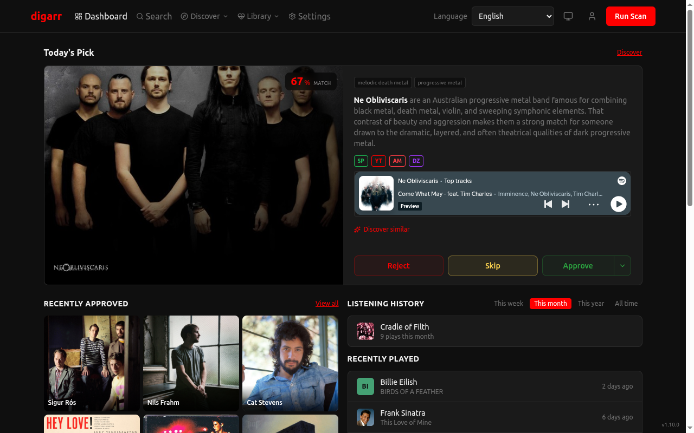

<p align="center">
  
</p>

<h1 align="center">Digarr</h1>

[](https://github.com/iuliandita/digarr/actions/workflows/ci.yml)
[](LICENSE)
[](https://bun.sh)
[](https://www.typescriptlang.org)
[](deploy/docker/)
[](https://github.com/iuliandita/digarr/actions/workflows/ci.yml)
[](https://github.com/iuliandita/digarr/releases)

**Self-hosted music discovery for your library.** Digarr finds artists and albums from your listening history or a mood. Review the suggestions, listen to previews, then send what you like to Lidarr, slskd, or a playlist. Bring your own AI provider or local model. Lidarr is optional.

> [!NOTE]
> **v1.19.0 is out.** This release adds optional genre priorities and playlist generation outcomes, improves discovery taste profiles and seed selection, and explains unavailable previews. See the [changelog](CHANGELOG.md) for release details.



This dashboard capture predates v1.19.0; see [current behavior and screenshots](docs/SCREENSHOTS.md).

[More screenshots](docs/SCREENSHOTS.md) | [Quick start](#quick-start) | [Configuration](#configuration) | [Documentation](#documentation)

## What you can do

- **Find artists and albums.** Connect a listening source, scan, and review scored suggestions. Release Radar finds new releases; Library Gap-Fill finds missing albums. Mood and artist searches work without a listening history.
- **Review before adding.** Preview, approve, reject, or permanently block suggestions. Individual album approval monitors and searches only that album in Lidarr. Bulk and automatic approval use artist-level monitoring; see [known limitations](docs/OPERATIONS.md#known-limitations-in-v1190).
- **Keep discovery running.** Schedule scans and subscriptions, or generate playlists for Spotify and supported media servers. You can also export M3U/XSPF files. Media-server exports use music already in that server's library.
- **Share an instance.** Each user has their own queue, connections, and preferences; admins assign their available targets. Local accounts and OIDC/SSO are supported, with 15 languages and light and dark themes.

Digarr calls your connected services. It doesn't include a downloader or a full music player.

AI suggestions and MusicBrainz matches can be wrong, so check the artist and release before approving. Playlist generation reports local results; it doesn't verify remote playback. Media-server exports can substitute an unmatched track. See [known limitations](docs/OPERATIONS.md#known-limitations-in-v1190).

### Connections at a glance

| Use | Services |
|-----|----------|
| Scan taste-profile sources | ListenBrainz, Last.fm, Spotify, Plex, Jellyfin, Emby, Subsonic, Discogs |
| [Deezer feeds](docs/AUTHENTICATION.md#deezer-app-setup) | Flow, favorites, followed artists, and playlists (own app required) |
| Library sync | Lidarr, Plex, Jellyfin, Emby, Subsonic |
| Approval and acquisition | Lidarr, slskd |
| Playlist export | Spotify, Navidrome, Jellyfin, Emby, Plex |
| Search | Spotify, Deezer, MusicBrainz; Bandcamp and TIDAL (both experimental) |
| AI recommendations | Anthropic, OpenAI, Gemini, Ollama, OpenAI-compatible endpoints |
| Notifications | Webhooks, ntfy, Telegram, Apprise |

A connection's capabilities differ by service. Spotify Saved Albums and Followed Artists, Deezer Flow, and Subsonic Starred have focused discovery modes. [TIDAL Favorite Artists](#connecting-tidal) needs an admin-registered app; see its experimental status below.

### Privacy and credentials

Your database runs on your server. Connected services still receive requests: hosted AI providers receive discovery prompts, metadata services receive lookups, and embedded previews contact their providers. A local AI model keeps AI requests local, but does not make all of Digarr offline.

Set and retain `DIGARR_ENCRYPTION_KEY` before saving service credentials. Without it, sensitive database fields are stored unencrypted. Back up the key separately from the database; losing it means re-entering encrypted credentials. See the [key rotation guide](docs/runbooks/encryption-key-rotation.md) before changing an existing key.

## Quick start

You need Docker and access to an AI provider or local model. Digarr includes an embedded PostgreSQL database (PGlite), so this runs as one container:

```sh
mkdir digarr && cd digarr
(set -C; umask 077 && printf 'DIGARR_ENCRYPTION_KEY=%s\n' "$(openssl rand -hex 32)" > digarr.env)
docker run -d --name digarr -p 127.0.0.1:3000:3000 \
  --env-file ./digarr.env \
  -e ALLOWED_ORIGIN=http://localhost:3000 \
  -e DIGARR_ALLOW_INSECURE_COOKIES=true \
  -v digarr-data:/app/data -v digarr-backups:/app/backups \
  docker.io/iuliandita/digarr:latest
```

This local-only HTTP example needs OpenSSL and saves the key in protected `digarr.env`. Retain that file for container recreation and recovery. The cookie override avoids browser-dependent Secure-cookie handling on localhost. For other devices, configure an [HTTPS public origin](docs/AUTHENTICATION.md#public-origin-and-reverse-proxies); deliberate HTTP exposes session cookies to interception.

Open `http://localhost:3000` and complete setup. Passwords need 12 characters. The first account becomes admin; further local self-registration is closed by default. OIDC can still create accounts, so restrict access at your identity provider.

Use `:latest` for the newest release, a minor tag like `:1.19` for patch updates, or a specific patch like `:1.19.0` to pin a release. Only the newest release receives security fixes. See [image channels](deploy/docker/README.md#image-channels).

For Compose, backend selection, and updates, follow the [Docker guide](deploy/docker/README.md). Keep one app instance per database, verify its backend at `/health`, and [back up before upgrading](deploy/docker/README.md#back-up-and-update).

## Your first recommendations

1. Choose Lidarr, Emby, or discovery-only in the setup wizard and configure your AI provider.
2. Connect a listening source in Settings, or import artists from CSV or a supported playlist. You can add targets later.
3. Run a scan from Dashboard or Discover.
4. Preview, approve, or reject suggestions. Adjust genre priorities in **Settings > Recommendations** if needed; [API clients](docs/API.md#recommendations) can do the same. Use Release Radar or Library Gap-Fill for albums, or enable net-new album discovery.

A scan can complete with a failed source. Admins can check Job History for partial results; other users can refresh Discover. Services without similar-artist lookup still contribute their supported listening and library data. See the [pipeline guide](docs/ARCHITECTURE.md#pipeline) for the details.

## Configuration

<a id="connecting-plex-listeners"></a><a id="importing-slskd-downloads-into-lidarr"></a><a id="data-hygiene"></a>
Use Settings for connections, scoring, schedules, preferences, and language. Spotify's `Import Liked Songs` can seed a scan; admins can inspect failures in Job History. [Authentication](docs/AUTHENTICATION.md) covers origins, cookies, SSO, and proxies. [Operations](docs/OPERATIONS.md) covers Plex listeners, slskd imports, Data Hygiene, playlists, notifications, and local AI.

### Service apps

<a id="connecting-spotify"></a>**Spotify** needs your own OAuth app, a Premium app owner, and up to five allowlisted Development Mode users. Search needs a connected account. Local HTTP uses `127.0.0.1`, with the same `ALLOWED_ORIGIN` and browser address. Follow [Spotify setup](docs/AUTHENTICATION.md#spotify-app-setup) before changing the quick-start origin.

<a id="connecting-tidal"></a>**TIDAL is experimental:** authorization, refresh, and favorite-artist retrieval have not been tested with a live account. Catalog search needs admin-registered credentials; each user connects their own account for Favorite Artists. Follow [TIDAL setup](docs/AUTHENTICATION.md#tidal-app-setup). <a id="tidal-feedback"></a>The [feedback checklist](docs/AUTHENTICATION.md#tidal-feedback) explains what to report safely.

## Backup & Restore

Application JSON exports are partial; complete recovery requires a consistent database backup and the encryption key retained separately. Automatic backup failure does not stop migrations. Read [backup boundaries and recovery](docs/guides/switching-backends.md#backup-boundaries-and-recovery) before upgrading or restoring. [Operations](docs/OPERATIONS.md#backup--restore) covers application exports and version-specific upgrade notes.

## Deployment

| Method | Path | Notes |
|--------|------|-------|
| Docker Compose | [`deploy/docker/`](deploy/docker/) | Recommended. Choose single-container PGlite or the bundled PostgreSQL stack. Also on [Docker Hub](https://hub.docker.com/r/iuliandita/digarr). |
| Helm chart | [`deploy/helm/digarr/`](deploy/helm/digarr/) | Kubernetes. Embedded PGlite, bundled PostgreSQL, or your own database. Keep one app replica. |
| Raw k8s manifests | [`deploy/k8s/`](deploy/k8s/) | Reference manifests for advanced setups. |
| Unraid | [`docs/guides/unraid.md`](docs/guides/unraid.md) | In the Community Applications store (search "Digarr"); bundled template ([`deploy/unraid/digarr.xml`](deploy/unraid/digarr.xml)) as manual fallback. Embedded PGlite by default; external PostgreSQL optional. |
| Synology NAS | [`docs/guides/synology.md`](docs/guides/synology.md) | DSM 7.1+ (Docker/Container Manager). SSH or GUI. |
| Docker Desktop | [`docs/guides/docker-desktop.md`](docs/guides/docker-desktop.md) | macOS and Windows (WSL 2). |

Check [image signatures and SBOM coverage](deploy/docker/README.md#verifying-image-signatures) before running a release.

## Documentation

- [Configuration and operations](docs/OPERATIONS.md)
- [Authentication, SSO, and user management](docs/AUTHENTICATION.md)
- [API reference](docs/API.md) and [architecture](docs/ARCHITECTURE.md)
- [Recommendation quality evaluation](docs/RECOMMENDATION-QUALITY.md)
- [Switching database backends](docs/guides/switching-backends.md) and [encryption-key rotation](docs/runbooks/encryption-key-rotation.md)
- [Changelog](CHANGELOG.md), [roadmap](docs/ROADMAP.md), and [screenshots](docs/SCREENSHOTS.md)
- [Other self-hosted music projects](docs/COMPARISON.md)

## Contributing

Bug reports, translations, documentation fixes, and code contributions are welcome. See [CONTRIBUTING.md](CONTRIBUTING.md) for development setup and checks. Report security problems through the [private reporting process](SECURITY.md).

Most code and tests are AI-generated, with a human setting direction and reviewing changes.

## License

MIT. See [LICENSE](LICENSE).
