# Screenshots

The checked-in screenshots were captured from v1.10.0 and use the Youtarr
theme. The descriptions below reflect the current `develop`/`:nightly` UI when
later features are not visible in an image. Capture a fresh set with
`bun scripts/capture-screenshots.ts`; see that script's header for environment
variables.

## Dashboard (dark)

## Dashboard (light)

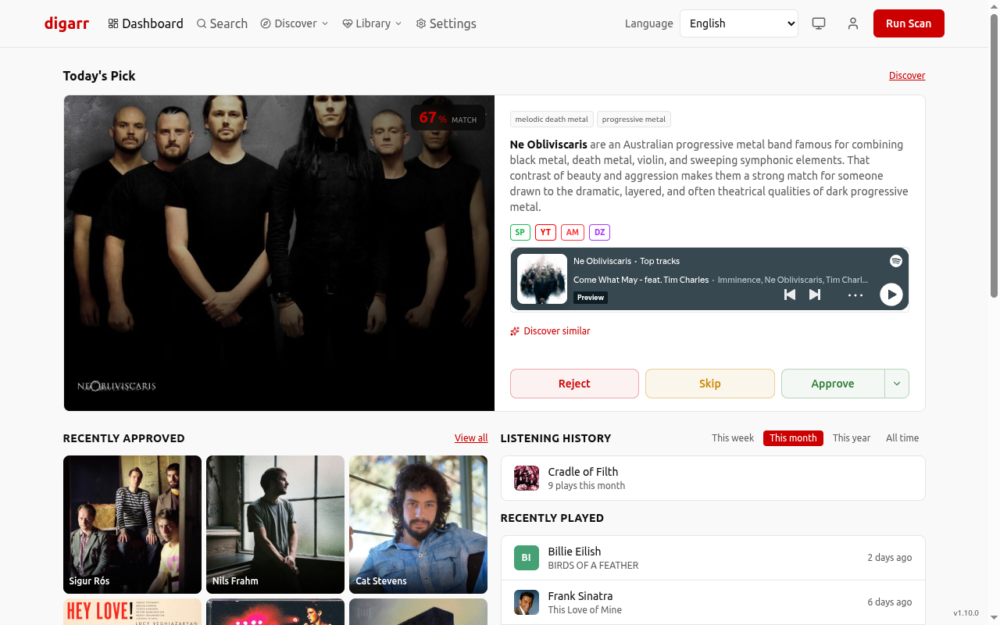

## Discover

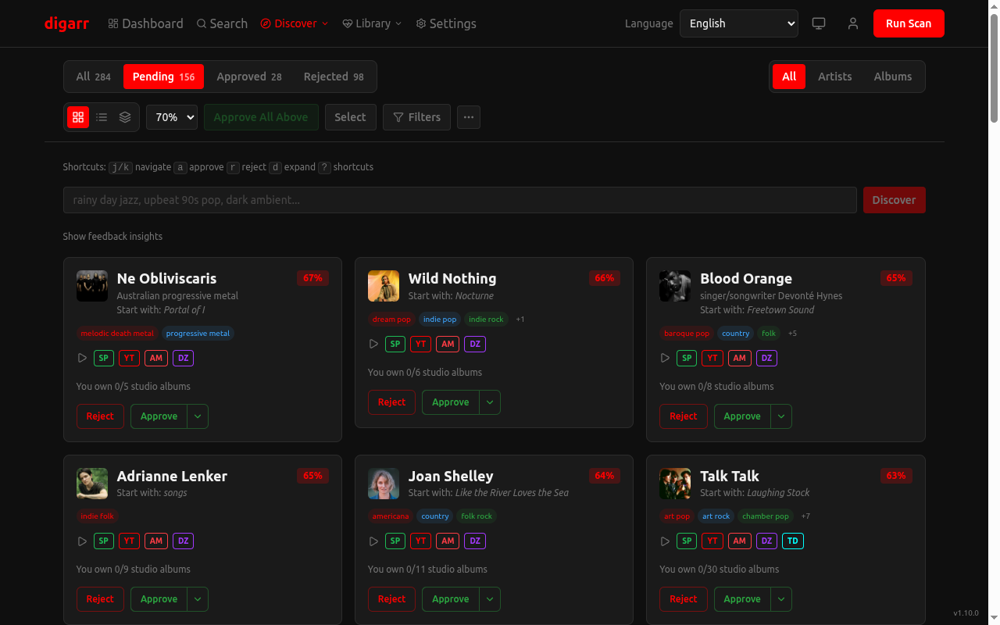

The normal Run Scan action is artist-focused. Album recommendations are produced by Library Gap-Fill, Release Radar, or the default-off net-new album discovery preference. If the Albums filter has no results, its empty state links to each producer and reveals the requested discovery mode or setting.

## Discovery Modes

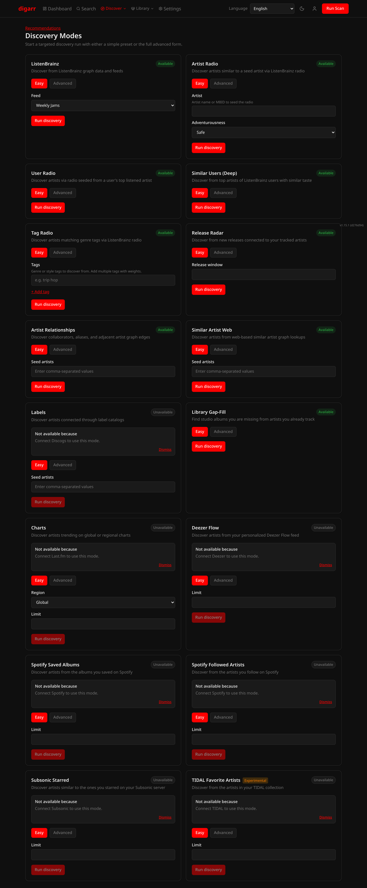

Discovery Modes lives on its own page under the Discover menu at `/discover/modes`. The shipped modes are ListenBrainz (Artist Radio, User Radio, Tag Radio, Similar Users Quick/Deep), Release Radar, Library Gap-Fill, Similar Artist Web, Artist Relationships (MusicBrainz graph), Labels (Discogs co-label artists), Charts (Last.fm global/regional), Deezer Flow, Spotify Saved Albums, and Subsonic Starred. Modes that need a connected account stay disabled until you connect it, and each blocked card shows an explicit reason. Manual runs preflight Artist Radio seeds and record job-backed feedback instead of a blind "started" toast. A `?mode=<id>` deep link scrolls to, focuses, and highlights the requested mode card.

## Search

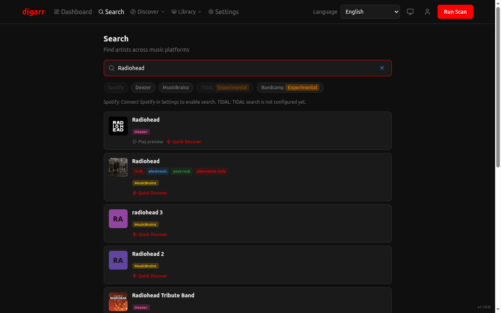

## Genres

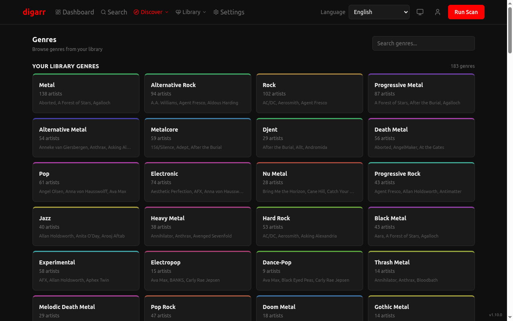

## Genre Detail

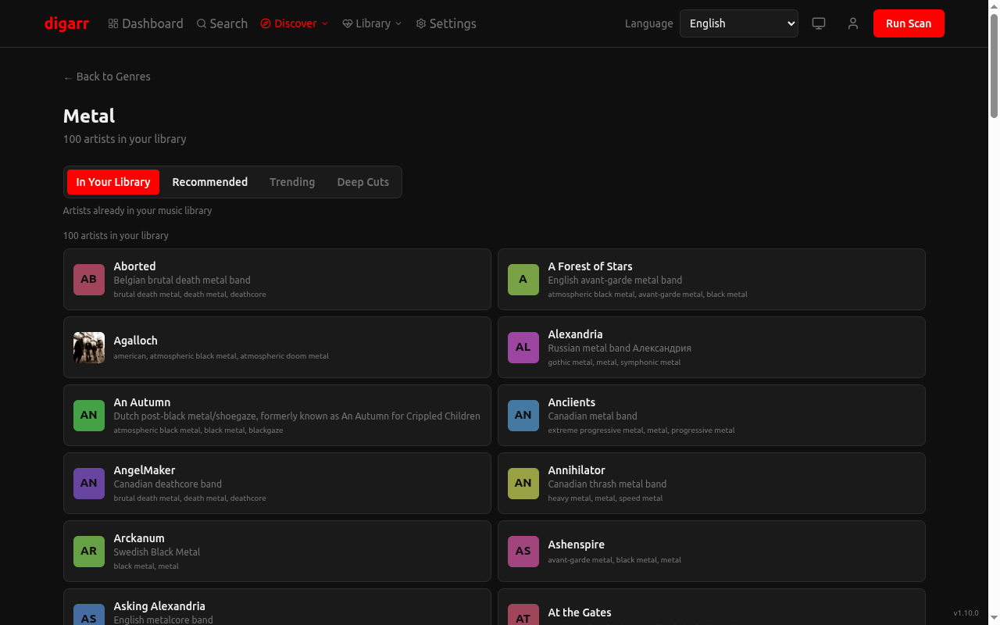

## Playlists

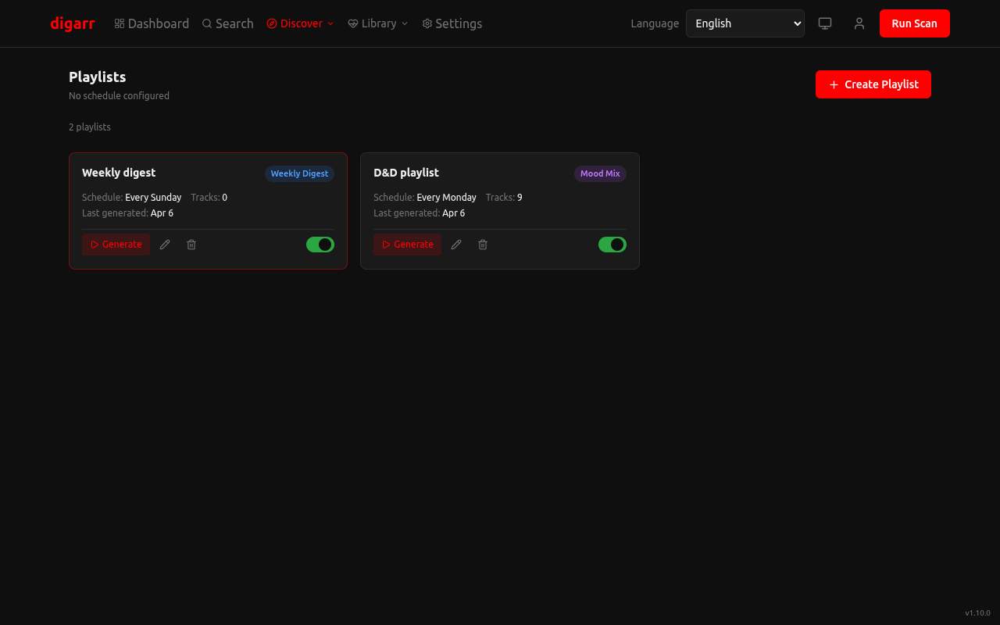

## Subscriptions

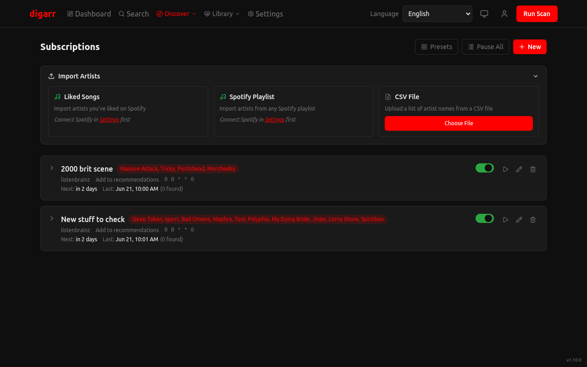

## Library Health

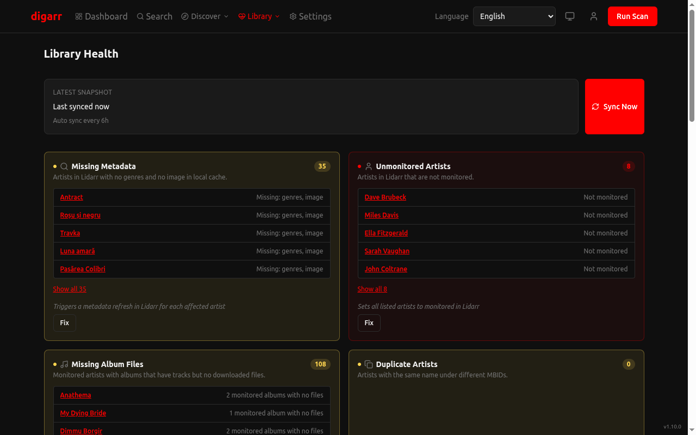

## Library Reconciliation

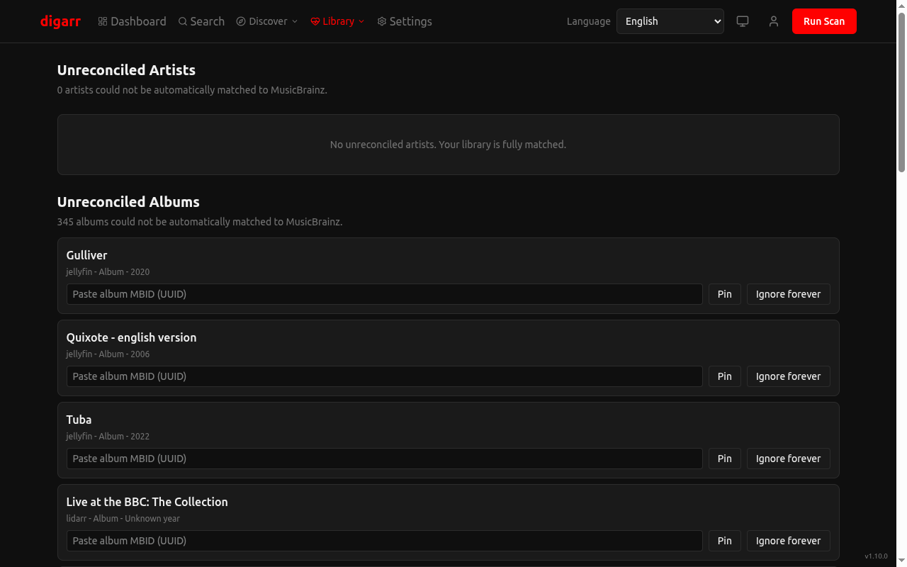

Shipped in `v0.17.0`: unreconciled-artist review plus manual correct/ignore override flow. Extended in `v0.19.0` with unreconciled-album review and album override persistence.

## Library Sources Panel

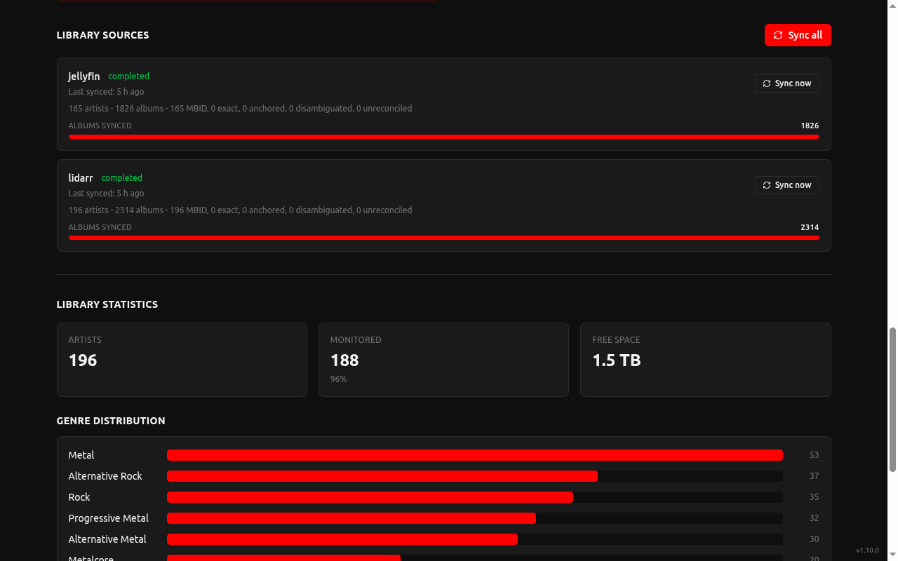

Admin panel on the Library Health page. Shipped in `v0.17.0` and expanded in `v0.18.0` with per-source album sync counts and snapshot status. Polished in `v0.19.0` with album sync coverage summaries.

## Analytics

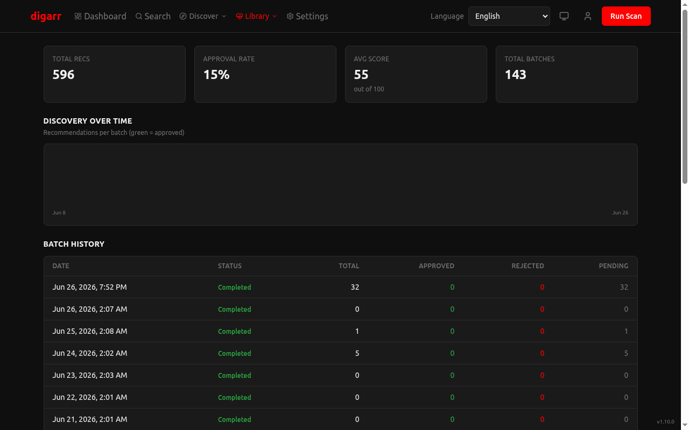

## Settings

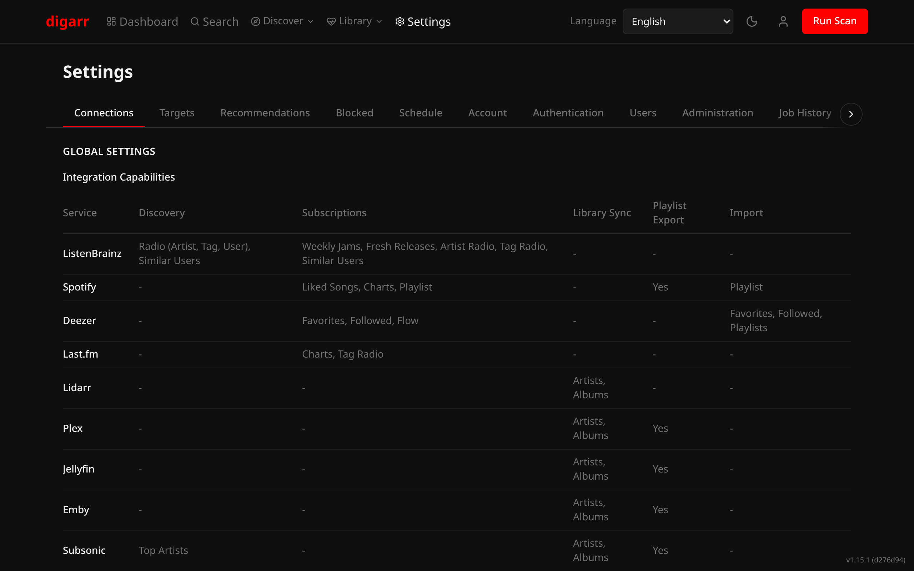

The current Settings > Targets flow also includes `slskd` target creation with an optional linked Lidarr target for combined approvals.

## Settings > Blocked

The screenshot capture script can produce `settings-blocked.png` for Settings > Blocked. That surface now includes separate permanent artist and album blocklists; no `settings-blocked.png` artifact is currently checked in.
