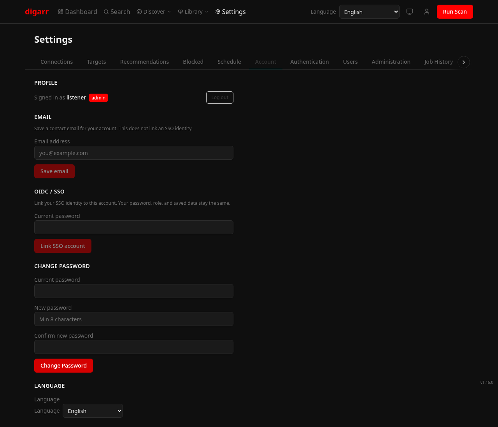
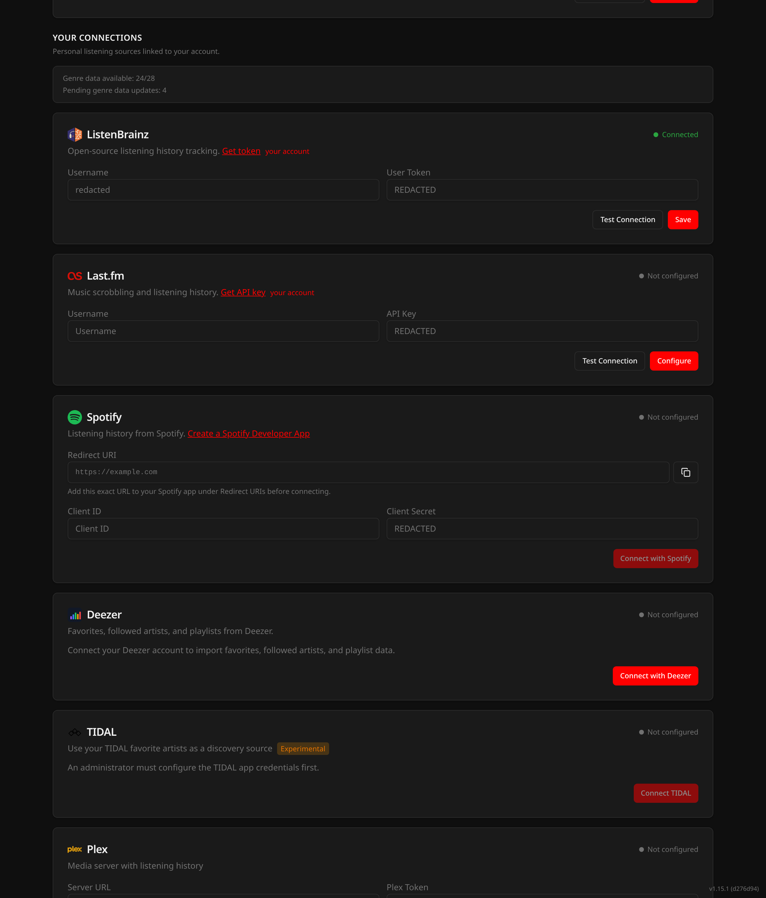

# Screenshots

The checked-in screenshots use the Youtarr theme. Most were captured from
v1.10.0; Analytics was refreshed from v1.12.0, and Discovery Modes, Settings,
Library Reconciliation, and Your Connections were refreshed from the current
`develop`/`:nightly` UI. The descriptions below reflect that UI when later
features are not visible in an image. Capture a fresh set with
`bun scripts/capture-screenshots.ts`; see that script's header for environment
variables.

## Dashboard (dark)

## Dashboard (light)

## Discover

The normal Run Scan action is artist-focused. Album recommendations are produced by Library Gap-Fill, Release Radar, or the default-off net-new album discovery preference. If the Albums filter has no results, its empty state links to each producer and reveals the requested discovery mode or setting.

## Discovery Modes

Discovery Modes lives on its own page under the Discover menu at `/discover/modes`. The shipped modes are ListenBrainz (Artist Radio, User Radio, Tag Radio, Similar Users Quick/Deep), Release Radar, Library Gap-Fill, Similar Artist Web, Artist Relationships (MusicBrainz graph), Labels (Discogs co-label artists), Charts (Last.fm global/regional), Deezer Flow, Spotify Saved Albums, Spotify Followed Artists, TIDAL Favorite Artists, and Subsonic Starred. Modes that need a connected account stay disabled until you connect it, and each blocked card shows an explicit reason. Manual runs preflight Artist Radio seeds and record job-backed feedback instead of a blind "started" toast. A `?mode=<id>` deep link scrolls to, focuses, and highlights the requested mode card.

TIDAL Favorite Artists carries an "Experimental" badge on both its mode card (visible in the image above) and its Settings connect card under Your Connections, because its OAuth flow has not yet been validated against a live TIDAL account ([#553](https://github.com/iuliandita/digarr/issues/553)).

## Search

## Genres

## Genre Detail

## Playlists

The current playlist form also offers Audition: one track per pending artist, with the existing schedule and target controls.

## Subscriptions

## Library Health

## Library Reconciliation

Shipped in `v0.17.0`: unreconciled-artist review plus manual correct/ignore override flow. Extended in `v0.19.0` with unreconciled-album review and album override persistence. Since `v1.15.0`, the view labels each artist and album as no match found, ambiguous match, or lookup failed; eligible rows can be selected, then ignored together through a confirmation dialog. Artist selection covers visible rows, album selection stays on the current page, and failed lookups remain available for retry instead of bulk ignore.

## Library Sources Panel

Admin panel on the Library Health page. Shipped in `v0.17.0` and expanded in `v0.18.0` with per-source album sync counts and snapshot status. Polished in `v0.19.0` with album sync coverage summaries.

## Analytics

The Discovery over time chart shows per-batch recommendation totals, with the approved portion in green.

## Settings

The tab row keeps native horizontal scrolling and shows conditional chevrons plus edge fades when more tabs are hidden in either direction. Selecting or deep-linking a tab scrolls it into view.

The current Settings > Targets flow includes `slskd` target creation with an optional linked Lidarr target and a download root visible to Lidarr. The Plex connection card also has a per-user listener selector populated by Test Connection; these controls are newer than the capture above.

## Settings > Account

The Account page offers password-confirmed SSO linking when OIDC is enabled and the local account is not linked yet. Linked accounts show their status; callback outcomes appear in a dismissible message. This capture uses a sample account with OIDC enabled.

## Settings > Your Connections

Per-user listening connections -- ListenBrainz, Last.fm, Spotify, Deezer, and TIDAL -- linked to your account. Input values and the instance host are redacted in the capture. The TIDAL card carries the Experimental badge until its OAuth flow is validated against a live account; connecting TIDAL requires an admin to configure the app credentials first.

## Settings > Blocked

The screenshot capture script can produce `settings-blocked.png` for Settings > Blocked. That surface now includes separate permanent artist and album blocklists; no `settings-blocked.png` artifact is currently checked in.
